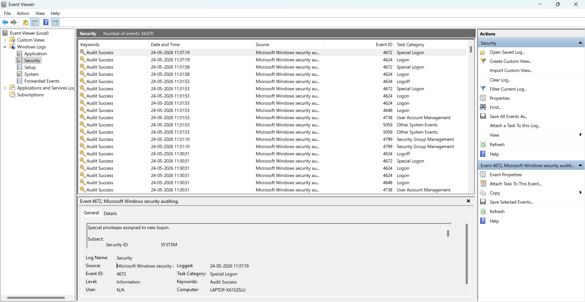
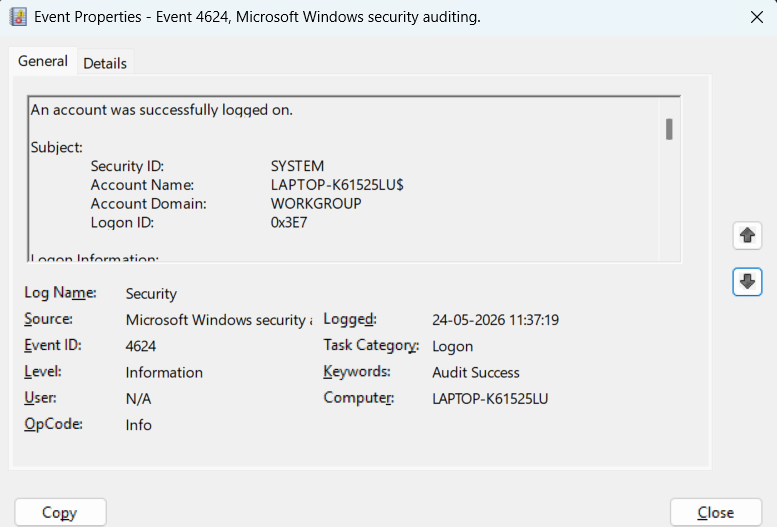
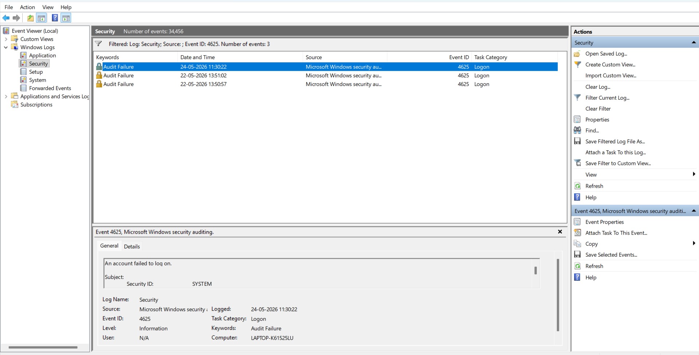

# Windows Event IDs

## Event ID 4625 - Failed Login

### Description
This event occurs when a login attempt fails.

### Why Important
SOC analysts monitor this event to detect:
- Brute force attacks
- Password spraying
- Unauthorized access attempts

### Investigation Steps
1. Check source IP address
2. Count repeated attempts
3. Verify targeted account
4. Identify login time pattern

### Example Detection
Multiple failed logins from same IP may indicate brute force attack.

# Windows Event IDs

## Event Viewer Security Logs

---

## Filter Current Log - Event ID 4625

---

## Failed Login Event - Event ID 4625

